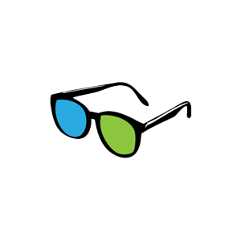

<a href="/">
    
</a>

# gle-gaussian-splat-3d

[](https://www.npmjs.com/package/gle-gaussian-splat-3d)
[](https://www.npmjs.com/package/gle-gaussian-splat-3d)
[](LICENSE)

A Three.js renderer for [3D Gaussian Splatting](https://repo-sam.inria.fr/fungraph/3d-gaussian-splatting/) —
the technique that turns a set of 2D photos into a photorealistic 3D scene you can fly through.

This is a typed fork of [mkkellogg/GaussianSplats3D](https://github.com/mkkellogg/GaussianSplats3D),
published to npm with bundled TypeScript declarations.

## Install

```shell
npm install gle-gaussian-splat-3d
```

## Use

```typescript
import { Viewer } from 'gle-gaussian-splat-3d';

const viewer = new Viewer({
  ignoreDevicePixelRatio: false,
  gpuAcceleratedSort: true
});

viewer.addSplatScene('<path to .ply, .splat, or .ksplat file>', {
  splatAlphaRemovalThreshold: 5, // out of 255
  halfPrecisionCovariancesOnGPU: true
}).then(() => {
  viewer.start();
});
```

That's the whole thing. The viewer creates its own canvas, camera, and controls, loads the
scene, and starts rendering. From there you can hand it your own renderer and camera, drop it
into an existing Three.js scene, or drive the render loop yourself — see
[Getting started](docs/getting-started.md).

> **Note:** the splat sorter uses a `SharedArrayBuffer` by default, which requires your server to
> send cross-origin isolation headers. If the console complains about `crossOriginIsolated`, see
> [Cross-origin isolation](docs/cross-origin-isolation.md).

## What you get

- **Pure Three.js.** Rendering happens entirely through Three.js, in modern ES modules.
- **Batteries included.** The built-in viewer needs very little code to load and view a scene.
- **Three formats.** Loads INRIA `.ply` files, standard `.splat` files, and the compact
  `.ksplat` format — and converts to `.ksplat` for you.
- **Your scene too.** Render a Three.js scene or object group alongside the splats.
- **WebXR.** Built-in VR and AR support.
- **View-dependent effects.** 1st and 2nd degree spherical harmonics.
- **Optimized.** Splats are culled with a custom octree before sorting, sorted in a C++/WASM
  worker using SIMD, with splat distances optionally pre-computed on the GPU via transform
  feedback.

## Documentation

| Guide | What's in it |
| --- | --- |
| [Getting started](docs/getting-started.md) | Install, load a scene, load several scenes, supported formats |
| [Viewer options](docs/viewer-options.md) | Every constructor and scene parameter, with a fully customized example |
| [Three.js integration](docs/threejs-integration.md) | Rendering your own objects alongside the splats, and `DropInViewer` |
| [Controls](docs/controls.md) | Mouse and keyboard reference for the built-in controls |
| [The .ksplat format](docs/ksplat-format.md) | Compression levels, and converting files from the browser or Node |
| [Cross-origin isolation](docs/cross-origin-isolation.md) | `SharedArrayBuffer`, COOP/COEP headers, Apache and Vite setup |
| [Development](docs/development.md) | Building from source, running the demo, project layout, releasing |
| [Limitations](docs/limitations.md) | Splat count limits, known issues, future work |

## Demo

An online demo of the upstream project is at
[projects.markkellogg.org](https://projects.markkellogg.org/threejs/demo_gaussian_splats_3d.php).

To run the demo scenes locally:

```shell
npm install
npm run build
npm run demo
```

Then open <http://127.0.0.1:8080/index.html>. You'll need the scene data, which lives outside
the repository — see [Development](docs/development.md#run-the-demo).

## Credits

The renderer is the work of [Mark Kellogg](https://github.com/mkkellogg). His implementation
began from the WebGL viewer by [antimatter15](https://github.com/antimatter15/splat) and the
WebGPU viewer by [cvlab-epfl](https://github.com/cvlab-epfl/gaussian-splatting-web), and is now
entirely his own code. This fork exists to publish it with TypeScript types.

Contributions to this fork are welcome — see [AGENTS.md](AGENTS.md) for how the project is built
and what the conventions are.

## License

[MIT](LICENSE) © Mark Kellogg
